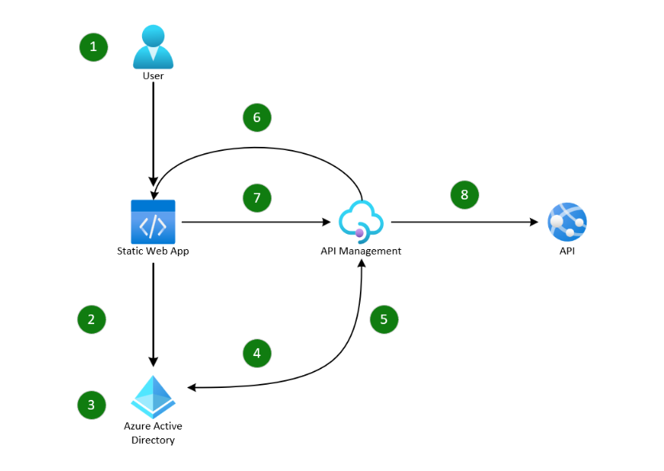

# No Token in the Browser Pattern using Azure API Management

This project is an example of how you can use Azure API Management to implement a stateless No Token in the Browser pattern for a JavaScript single-page application. Doing so helps to protect access tokens from cross-site scripting (XSS) attacks and keep malicious code from running in the browser. This implementation is described in detail on Microsoft Learn, see [Protect access tokens in a single-page application using Azure API Management](https://learn.microsoft.com/azure/architecture/guide/web/secure-single-page-application-authorization).

This architecture uses [API Management](https://azure.microsoft.com/products/api-management) to:

- Implement a [Backends for Frontends](/azure/architecture/patterns/backends-for-frontends) pattern that gets an OAuth2 access token from Azure Active Directory (Azure AD).
- Use Advanced Encryption Standard [AES](https://en.wikipedia.org/wiki/Advanced_Encryption_Standard) to encrypt and decrypt the access token.
- Store the token in an `HttpOnly` cookie.
- Proxy all API calls that require authorization.

Because the backend handles token acquisition, no other code or library, like [MSAL.js](https://github.com/AzureAD/microsoft-authentication-library-for-js), is required in the single-page application. When you use this design, no tokens are stored in the browser session or local storage. Encrypting and storing the access token in an `HttpOnly` cookie helps to protect it from [XSS](https://owasp.org/www-community/attacks/xss/) attacks. Scoping it to the API domain and setting `SameSite` to `Strict` ensures that the cookie is automatically sent with all proxied API first-party requests.

This example uses [Microsoft Graph API](https://learn.microsoft.com/graph/api/overview?view=graph-rest-1.0) as an example backend API, but the same principles apply to any backend API you want to call. To obtain an access token with the required scopes, the correct API permissions need to be added to the application registration in Azure Active Directory.

## Deploy this example

For information on how to deploy and configure the solution, please consult the [Deployment guide](docs/deployment-guide.md).

## Overview

The pattern works as follows:

1. A user selects **Sign in** in the single-page application.
2. The single-page application invokes Authorization Code flow by using a redirect to the Azure AD authorization endpoint.
3. Users authenticate themselves.
4. An Authorization Code flow response with an authorization code is redirected to the API Management callback endpoint.
5. The API Management policy exchanges the authorization code for an access token by calling the Azure AD token endpoint.
6. The Azure API Management policy redirects to the application and places the encrypted access token in an `HttpOnly` cookie.
7. The user invokes an external API call from the application via an API Management proxied endpoint.
8. The API Management policy receives the API request, decrypts the cookie, and makes a downstream API call, adding the access token as an `Authorization` header.

## Enhancements

This example isn't a production-ready solution, merely a demonstration of what is possible using these services. The following points should be considered to enhance any solution before using it in production.

- This example doesn't cater for access token expiry nor the use of refresh or ID tokens.
- The cookie contents in the sample are encrypted using AES encryption. The key is stored as a secret in the Named Values section of the API Management instance. This Named Value can be linked and stored in an [Azure Key Vault](https://azure.microsoft.com/services/key-vault/) to provide better protection of the key. Encryption keys should be rotated on a periodic basis as part of a [Key Management](https://en.wikipedia.org/wiki/Key_management) policy.
- This example only proxies calls to a single downstream API, which only requires one access token, allowing a stateless approach. However, due to the size limitation of HTTP cookies, if you need to proxy calls to multiple downstream APIs, would either need to use multiple cookies, or taking a stateful approach. This would involve storing access tokens in a cache and retrieving them based on the API being called and a key provided in the cookie rather than a single access token. This action can be achieved using the API Management [Cache](https://learn.microsoft.com/azure/api-management/api-management-howto-cache) or an external [Redis cache](https://learn.microsoft.com/azure/api-management/api-management-howto-cache-external).
- As this example only demonstrates the retrieval of data using a `GET` request it doesn't include protection from [CSRF](https://owasp.org/www-community/attacks/csrf) attacks, which would be required if other http methods such as `POST`, `PUT`, `PATCH`, or `DELETE` were to be implemented.
