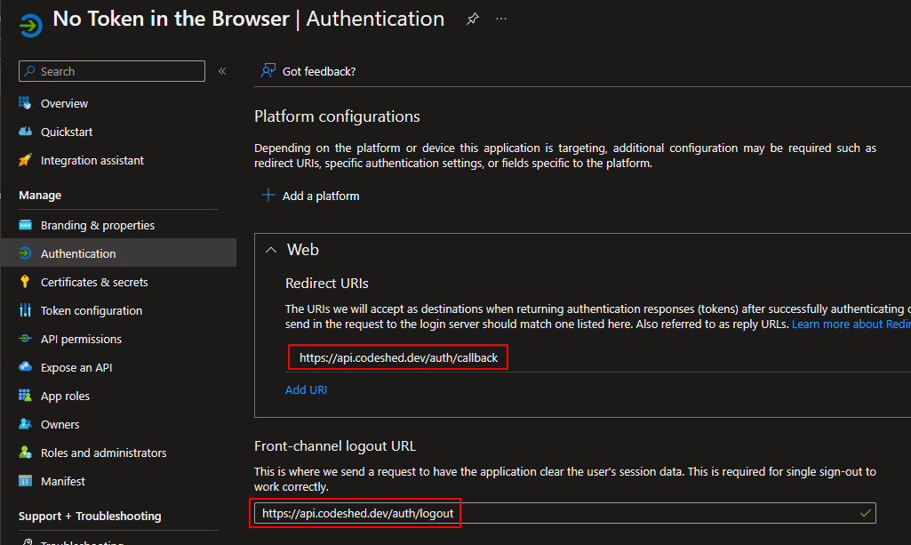
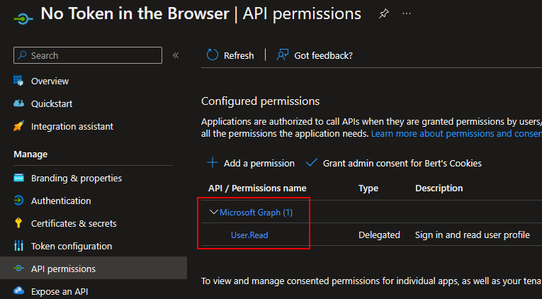
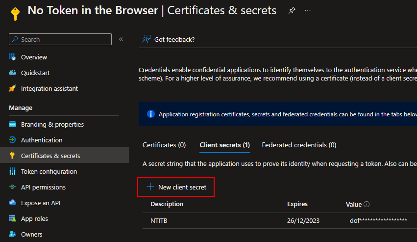
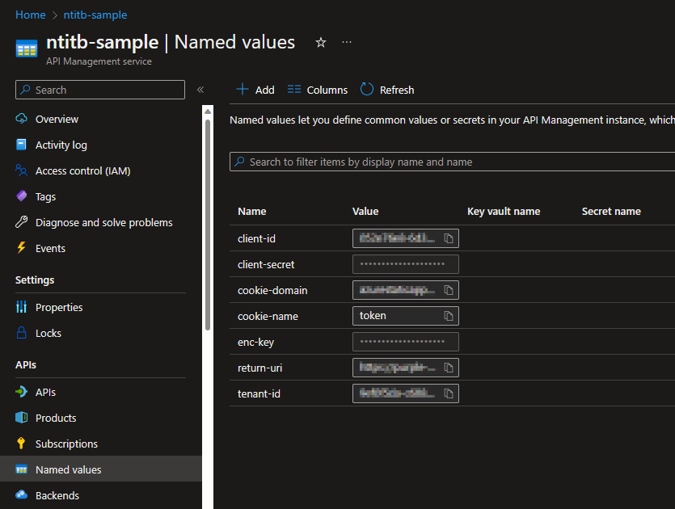
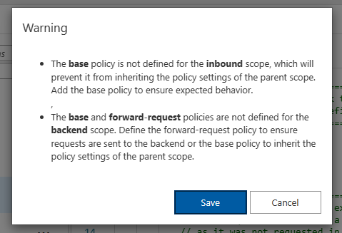
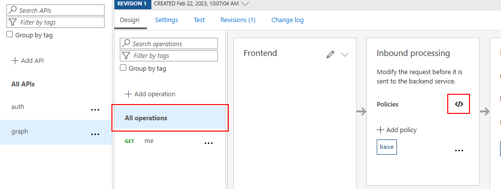
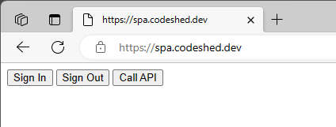

# Deployment guide

The sections below detail how to configure the resources required to implement this example. This project uses the domain `codeshed.dev` throughout, with the single-page application hosted at `spa.codeshed.dev` and the API Management gateway registered as `api.codeshed.dev`. These values will need to be replaced with your own domain and subdomain names as appropriate.

As this example uses `SameSite=Strict` cookies, the domain of the API Management gateway must be the same as the domain of the single-page application. This is because the cookie is only sent to the API Management gateway when the API request comes from a site with the same domain. If the domains are different then the cookie will not be sent in the request to the API Management gateway and the proxied API request will be considered unauthenticated.

> Note: It is possible to configure this example without using custom domains for the API Management instance and Static Web App, but the policy applied to the `callback` API method would need to be amended to `SameSite=None` and the `return-uri` named value would need to be set to the domain of the Static Web App. This, however, provides a less secure implementation as the cookie will be sent to any instance of API Management gateway and not constrained to your own domain. More on SameSite cookies can be read [here](https://developer.mozilla.org/docs/Web/HTTP/Headers/Set-Cookie/SameSite).

To learn more about using custom domains on Azure resources, see [Manage custom domains for Azure Static Web Apps](https://learn.microsoft.com/azure/static-web-apps/custom-domain), and [Configure a custom domain name for your Azure API Management instance](https://learn.microsoft.com/azure/api-management/configure-custom-domain). For more information on how to configure DNS records for custom domains, see [How to manage DNS Zones in the Azure portal](https://learn.microsoft.com/azure/dns/dns-operations-dnszones-portal).

## Prerequisites

This example requires the following to be created in your **Microsoft Entra ID tenant**.

- **Microsoft Entra ID Application Registration**
  - A client application registration is used to generate the client id and client secret required for the API Management gateway to acquire an access token.
  - **Quickstart:** [Register an application with the Microsoft identity platform](https://learn.microsoft.com/entra/identity-platform/quickstart-register-app).

This example requires the following resources to be created in your **Azure subscription**, within a single resource group.

- **Azure API Management service**
  - This is used to host the API definitions and policies required to implement the authorization flow and logout functionalitym as well as proxy the API requests to the backend service.
  - **Quickstart:** [Create a new Azure API Management service instance by using the Azure portal](https://learn.microsoft.com/azure/api-management/get-started-create-service-instance).
- **Azure Static Web App**
  - This is used to host the single-page application. When configuring the static web app select a GitHub repository with the SPA sample code as a deployment source.
  - **Quickstart:** [Building your first static site with Azure Static Web Apps](https://learn.microsoft.com/azure/static-web-apps/getting-started).
- **Azure Key Vault** _(optional)_
  - This can optionally be used to store the client secret generated in the application registration and other secret values.
  - **Quickstart:** [Create a Key Vault using the Azure portal](https://learn.microsoft.com/azure/key-vault/general/quick-create-portal).

## Application registration configuration

Once registered, the application registration requires the following properties configured:

- Redirect URI
- Client secret
- API permissions
- Front-channel logout URL

When creating the application registration, the sign in audience chosen will determine the Microsoft Entra ID endpoints required for authorization and token acquisition. This example project uses a single tenant application registration, which only allows users from a single directory to access it. If a multi-tenant application is used, then the tenant id should be replaced with the appropriate alternative common setting.

Even though this example is a single-page application, due to the backend for frontend pattern, the OAuth2 application is considered a confidential client as token acquisition is handled by the API Management gateway, which can keep the client secret value secure either as a secret named value, or by linking it to a secret in a Key Vault.

The redirect URI should be configured as a **Web** redirect and pointed to the domain of the API Management gateway and the API callback operation, for example: `https://<APIM DOMAIN>/auth/callback`.

To enable the single-page application to log out of the API Management gateway, the front channel logout URL should be configured to the domain of the Azure API Management gateway logout operation, for example: `https://<APIM DOMAIN>/auth/logout`. This will ensure that the cookie is removed from the browser when the user logs out of Microsoft Entra ID.

As this example uses Microsoft Graph API as the proxied API to call, we need to add the permission `User.Read` to the application. Depending upon how you create the application registration this will probably be added for you by default.

Finally, a client secret is required to be generated for the API Management gateway to enable the authorization code to be exchanged for an access token. This secret is not required in the single-page application, but will be stored as a named value in the API Management gateway.

## API Management configuration

Once the API Management gateway has been created several parameters need to be registered under [Named Values](https://learn.microsoft.com/azure/api-management/api-management-howto-properties) to be referenced by the policies. Theses values are:

- `tenant-id`
  - The Microsoft Entra ID tenant ID.
- `client-id`
  - The application registration client ID.
- `client-secret`
  - The secret generated in the application registration.
- `cookie-domain`
  - The domain to scope the cookie.
- `cookie-name`
  - The name of the cookie.
- `return-uri`
  - The URI to redirect back to after token acquisition is complete and to define the CORS policy allowed origins.
- `enc-key`
  - The [AES](https://en.wikipedia.org/wiki/Advanced_Encryption_Standard) encryption key in base64 encoded format. AES supports three different key lengths: 128, 192, and 256 bits. A 256 bit key can be created using [OpenSSL](https://www.openssl.org/) with the following command: `openssl rand -base64 32`.

Names Values can be added to the API Management gateway using the Azure Portal or the [Azure CLI](https://learn.microsoft.com/cli/azure/apim/nv?view=azure-cli-latest#az-apim-nv-create). Once created the values can viewed in the portal and referenced in an API Management policy using the `@NamedValue` syntax.

### Configuring the API endpoints

There are two APIs defined - both are listed in the [/src/api](/src/api) directory. The first is for the authorization functionality, and should be defined with an API URL Suffix of `auth`. Within this two `GET` methods are defined: `callback` and `logout`. Each of these has its own policy to be applied. This definition does not need a web service URL defined as it never passes the API request onto a backend service.

These API definitions can be imported using the OpenApi specification files located in the [src/api](/src/api/) directory. Guidance on how to import these can be found in the [Import an OpenAPI definition](https://learn.microsoft.com/azure/api-management/import-and-publish) documentation.

#### Configure the `auth` endpoint

When importing the API definition for the `auth` API ensure the URL scheme `HTTPS` is selected and the API URL Suffix is set to `auth`.

After the API definition has been imported, you should disable the requirement for a subscription key when making API calls. This can be found under the **Settings** tab of the API definition.

Once the API definitions have been imported, the API Management policies can be edited. Each of the API definitions has it's own policy. The `callback` policy acts as the redirect for the Microsoft Entra ID application, and receives the authorization code following user authentication. This policy then exchanges the code for an access token before encrypting it into a cookie and returning it to the single-page application. The `logout` policy simply removes the cookie from the browser.

To edit a policy, first select the API method and then click on the **Policies** button in the portal.

Open the callback policy file and copy the contents into the policy editor, overwriting all existing contents, then click **Save**. When saving either of the `auth` policies you will be presented with a warning that base policy is not defined. This is fine as we are not using a base policy for these operations.

Once you have completed applying the policy for the callback operation, repeat the process for the logout operation.

#### Configure the `graph` endpoint

The second API definition is for the Microsoft Graph API and acts as a proxy for all requests to this service. This should be defined with an API URL Suffix of `graph` and a web service URL of `https://graph.microsoft.com/v1.0`. As with the `auth` API, also be sure to disable the requirement for a subscription key when making API calls.

The base policy should be applied to **All operations** defined for this API definition. This defines the CORS policy, performs the decryption of the cookie, and addition of the extracted access token to the Authorization header before proxying the API request to the defined backend service.

To edit the policy, first select **All operations** and then click on the **Policies** button in the portal.

Open the all operations policy file and copy the contents into the policy editor, overwriting all existing contents, then click **Save**.

> Note: If you are a user of Visual Studio Code, API Management policies can be edited using the [Azure API Management extension](https://marketplace.visualstudio.com/items?itemName=ms-azuretools.vscode-apimanagement). This extension also provides syntax highlighting and validation of the policy XML.

## Static Web App configuration

To test the deployment of the APIs, the single-page application should be deployed to a static web app. Copy the two single-page files from the [src/spa](/src/spa) directory into a new GitHub repository and deploy it to a static web app. The static web app should be configured to use the `index.html` file as the default document.

The `site.js` file contains three values that need to be updated to match your configuration:

- `baseUri`
  - The base URI of your API Management instance.
- `clientId`
  - The application registration client id.
- `tenantId`
  - The Microsoft Entra ID tenant id.

## Try it out

Once the static web app has been deployed, the single-page application can be accessed from the custom URL assigned by you. You will be presented with a simple interface with three buttons:

Clicking the **Sign In** button will redirect you to the Microsoft Entra ID login page. Once you have authenticated, you will be redirected back to the single-page application and a cookie will be set containing the access token.

Clicking the **Call API** button will make a request to the Microsoft Graph API to retrieve the details of the authenticated user. The request will be proxied through the API Management gateway and the access token will be added to the request as an Authorization header.

Clicking the **Sign Out** button will sign the user out from Microsoft Entra ID and remove the cookie from the browser.

## Cleaning up

To remove the resources created in this tutorial, delete the resource group created in the [Prerequisites](#prerequisites) section, and delete the application registration created the Microsoft Entra ID.